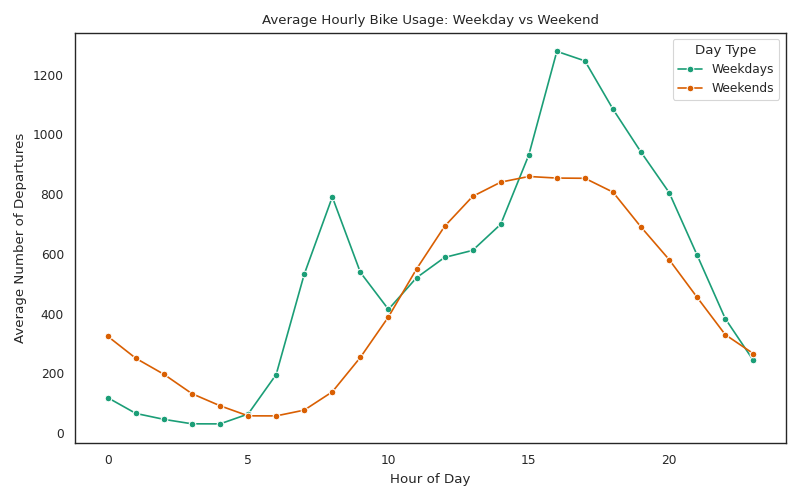
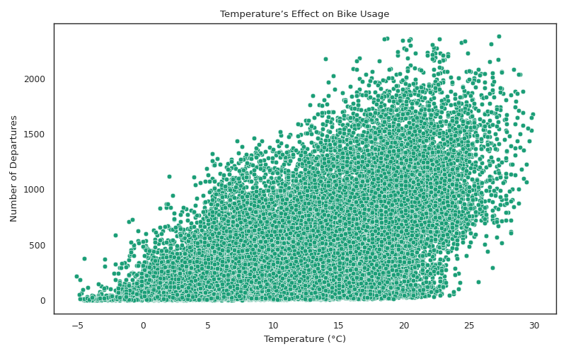
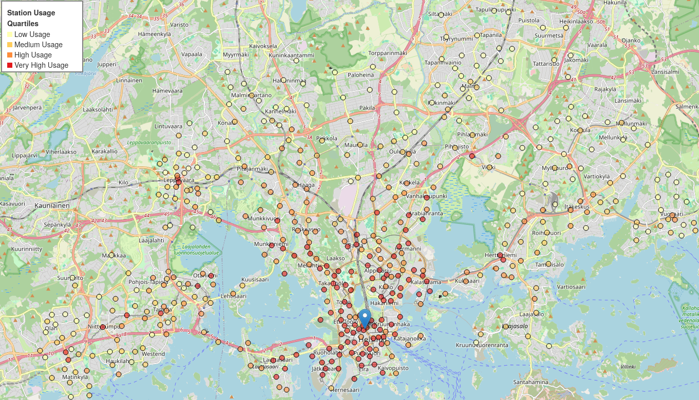
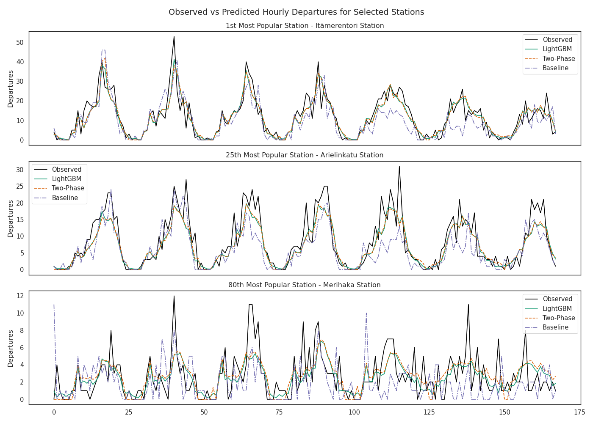
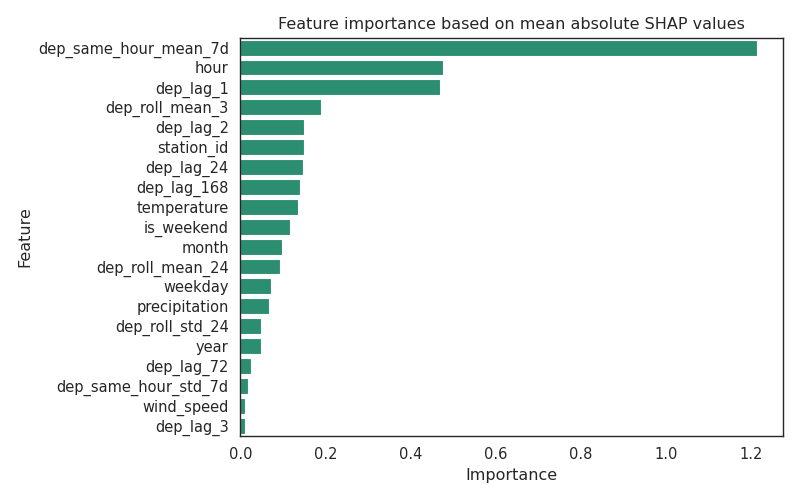

# Helsinki City Bike Demand Analysis and Prediction

## Overview
This project analyzes and predicts **Helsinki city bike departures** using historical trip data, weather conditions, and station location features.  
The goal is to uncover patterns in bike usage across time, geography, and environmental factors, and to build predictive models that can estimate the number of bike departures from each station at a given time.

### Key Objectives
- Explore relationships between usage, weather, and time variables  
- Identify high-demand stations and peak usage periods  
- Develop machine learning models to forecast bike departures

---

## Repository structure
```
project/
│
├── data/            # Raw and processed datasets
├── figures/         # Visualizations and generated plots
├── models/          # Trained models (created after running training scripts)
├── notebooks/       # Jupyter notebooks for EDA and modeling
├── scripts/         # Python scripts for data processing, modeling, and visualization
├── citybike/        # Helper functions and reusable utilities (custom package)
├── requirements.txt # List of dependencies
└── README.md        # Project documentation
```
---

## Data Sources
This project integrates multiple open datasets combining trip records, station metadata, and hourly weather observations to capture temporal, spatial, and environmental factors influencing bike usage.
- **[City Bike Trip Data](https://www.hsl.fi/en/opendata)** – © City Bike Finland 2025.  
  Licensed under [CC BY 4.0](https://creativecommons.org/licenses/by/4.0/).

- **[Station Data from Digitransit and OpenStreetMap](https://digitransit.fi/en/developers/apis/)** –  
  Station locations retrieved via the Digitransit Routing API and directly from [OpenStreetMap](https://www.openstreetmap.org).  
  © Digitransit 2025 / © OpenStreetMap contributors. Licensed under [ODbL](https://opendatacommons.org/licenses/odbl/).

- **[FMI Open Data API](https://en.ilmatieteenlaitos.fi/open-data)** –  
  Hourly weather observations. Licensed under [CC BY 4.0](https://creativecommons.org/licenses/by/4.0/).

---

## Methods and Tools
| Category | Libraries / Packages |
|-----------|----------------------|
| **Data Processing** | `pandas`, `numpy` |
| **Visualization** | `matplotlib`, `seaborn`, `folium` |
| **Machine Learning** | `lightgbm`, `sklearn`, `hyperopt`, `shap` |
| **APIs & External Data** | `fmiopendata` (weather data), `overpy` (OpenStreetMap data) |

---
## Project Workflow
1. **Data Collection:** Fetch trip, weather, and station data from APIs.  
2. **Data Cleaning:** Remove outliers, merge datasets, and handle missing values.  
3. **Feature Engineering:** Generate lag, time, weather, and location-based features. 
4. **Modeling:** Train LightGBM models (single-stage and two-phase).  
5. **Evaluation & Interpretation:** Assess performance and analyze SHAP values.
---
## Results & Insights

### Temporal Patterns
  
*Figure 1: Daily usage patterns for weekdays and weekends.*

On weekdays, usage follows typical working hours, with clear morning and evening peaks.  
On weekends, peaks are broader and lower, reflecting more balanced leisure usage through the middle of the day and afternoon.

### Weather Influence

  
*Figure 2: Relationship between temperature and bike usage.*

Bike usage increases steadily as temperature rises, suggesting weather conditions strongly influence rider activity. Cooler hours show lower ridership, while warmer hours see significantly higher demand.

### Spatial Patterns 
  
*Figure 3: Spatial distribution of city bike stations and usage intensity.* 

The map highlights a dense cluster of high-activity stations around Helsinki city center (marked in blue).  
Usage decreases with distance from the center, indicating proximity to central areas is a key driver of bike demand.

### Two-Phase Model – Classification Results

| Metric | Class 0 (Zero Departures) | Class 1 (Non-Zero Departures) | Overall / Avg |
|---------|---------------------------|--------------------------------|----------------|
| **Precision** | 0.7990 | 0.8562 | — |
| **Recall** | 0.7113 | 0.9058 | — |
| **F1-score** | 0.7526 | 0.8803 | — |
| **Accuracy** | — | — | **0.8387** |

The classifier achieves an overall accuracy of 83.9%, with particularly strong recall for non-zero departure hours (90.6%).
Lower recall for zero-departure hours (71.1%) indicates the model occasionally predicts activity during actual zero-usage periods.

### Regression Performance
| Model                 | MAE  | RMSE | R²    |
|------------------------|------|------|-------|
| **Baseline**           | 1.92 | 3.30 | 0.330 |
| **LightGBM Regression** | 1.39 | 2.22 | 0.698 |
| **LightGBM Two-Phase**  | 1.42 | 2.25 | 0.687 |

Both LightGBM models significantly outperform the naive baseline, which predicts departures based on the same hour one week earlier.  
The single-stage LightGBM regression model achieves slightly better performance across all metrics. The two-phase model introduces additional error due to false non-zero predictions.

### Weekly Prediction Comparison
  
*Figure 4: Observed vs. predicted hourly departures for three stations over one week.*

LightGBM models capture the daily cycle well, especially at high-volume stations.
Prediction accuracy decreases for lower-volume stations, where higher variability makes patterns harder to model.  
The weekly naive baseline captures the general daily cycle, but struggles with week-to-week variations, leading to larger prediction errors.

### Model Interpretability – SHAP Analysis
  
*Figure 5: SHAP summary plot showing feature impact on predicted bike departures.*  

The SHAP analysis shows that the model relies primarily on lag-based features, capturing strong temporal patterns and recent activity trends.  

- 7-day average for the same hour: The most influential feature, reflecting consistent weekly ridership patterns.  
- Short-term lags (`lag_1`, `lag_2`): Capture immediate trends from the previous one or two hours.  
- Daily and weekly cycles (`lag_24`, `lag_168`) and rolling statistics: Capture periodic behavior and local variability.    
- Temporal features: Hour of day strongly influences predictions, aligning with commuting peaks.  
- Weather features: Temperature and precipitation meaningfully affect usage, while wind speed and rain contribute little.  
- Station ID: Carries significant predictive power, suggesting the model learns station-specific patterns, while location and maximum capacity add limited information.  

These results confirm that the model effectively captures short- and long-term temporal dependencies, while weather and station-level factors play secondary but meaningful roles.

### Summary of Findings
The analysis demonstrates that **Helsinki city bike demand** follows strong temporal cycles driven by commuting behavior and weather conditions.  
The LightGBM regression model delivers accurate short-term predictions.  
SHAP analysis confirms that lag-based, temporal, and weather features are the most influential predictors, capturing both short-term fluctuations and weekly seasonality.

---

## Usage
### 1. Install dependencies
```
pip install -r requirements.txt
```
### 2. Fetch and clean data
```
# Fetch raw trip, weather, and station data
python scripts/fetch_bike_data.py --start-year 2020 --end-year 2024 --output data/raw/bike_rides.csv
python scripts/fetch_weather_data.py --start-year 2020 --end-year 2024 --output data/raw/weather.csv
python scripts/fetch_station_data.py --output data/raw/stations.csv --api-key [API_KEY]

# Clean the datasets
python scripts/clean_data.py --ride-data data/raw/bike_rides.csv --station-data data/raw/stations.csv --weather-data data/raw/weather.csv --bike-output data/clean/bike_rides_clean.csv --weather-output data/clean/weather_clean.csv
```
An API key is required to access station data from Digitransit. If none is provided, the script retrieves data from OpenStreetMap (OSM) instead.
### 3. Feature engineering and training
```
# Create feature datasets
python scripts/feature_engineering.py --bike-data data/clean/bike_rides_clean.csv --weather-data data/clean/weather_clean.csv --output-train data/processed/train.csv --output-test data/processed/test.csv

# Train models and save outputs to /models
python scripts/train_model.py --train-data data/processed/train.csv --output-dir models
```
### Evaluation
```
python scripts/evaluate_model.py
```
The evaluation script compares the single-stage LightGBM regressor and the two-phase LightGBM model
(classification + regression) against a naive baseline, which predicts departures using the value from the same hour one week earlier.
